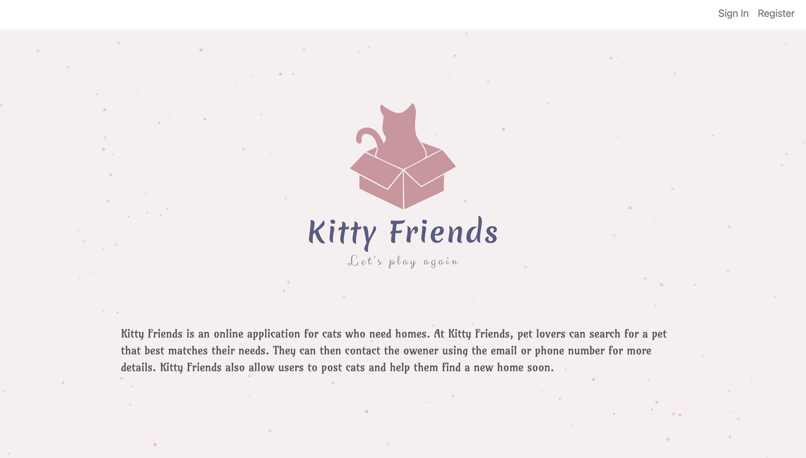
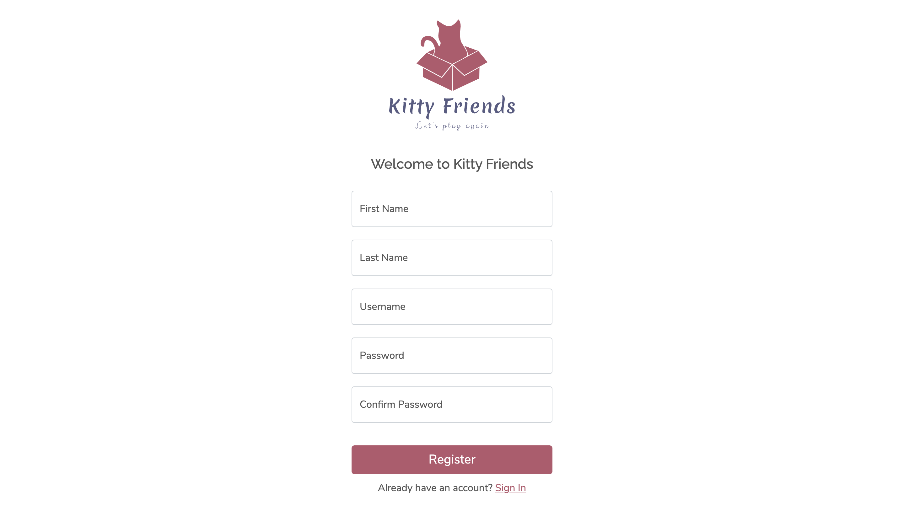
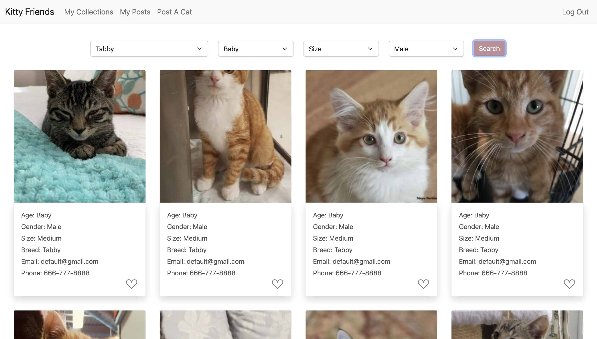
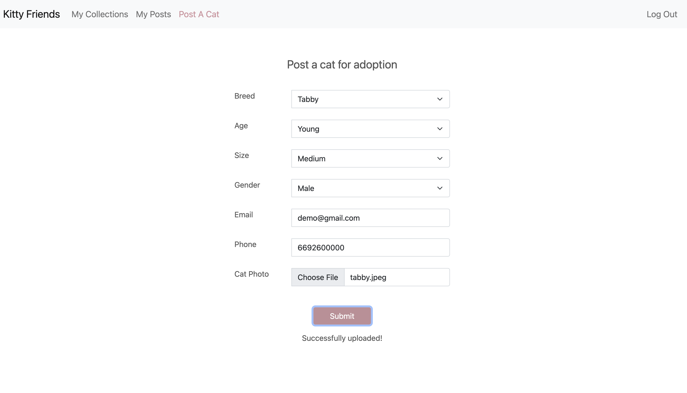
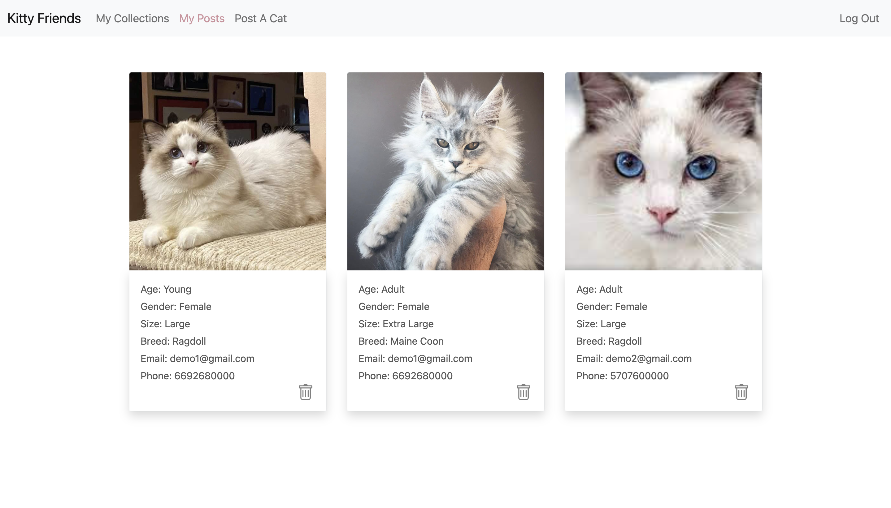
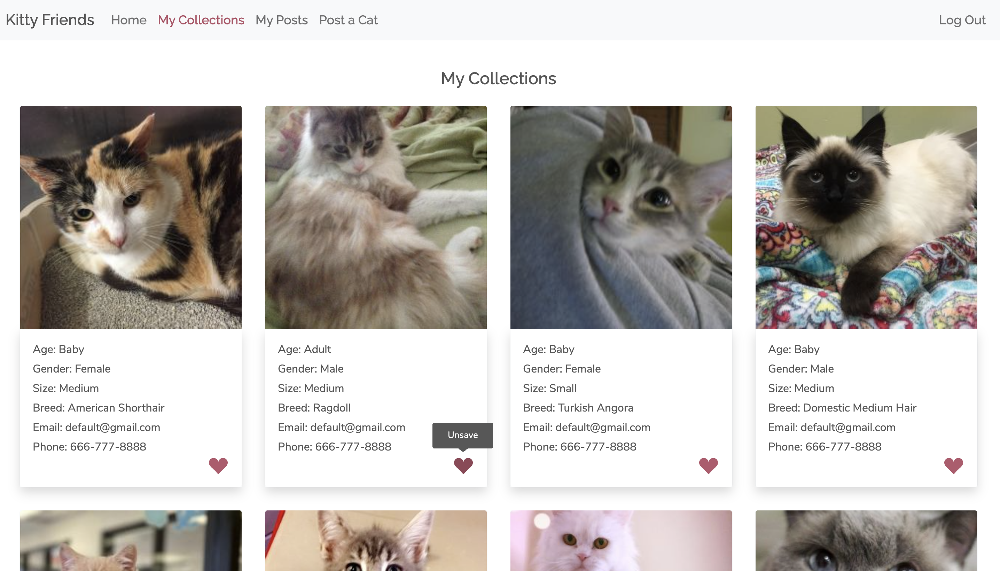

### App Name: Kitty Friends

Kitty Friends is an online application helping cats to find new homes.  
Link: https://kitty-friends-app.herokuapp.com/

### App Features:

- Pet lovers can view and search for pets that best matches their needs.
- They can then contact the owener using the email or phone number for more details.
- Kitty Friends also allow users to post cats and help them find a new home soon.
- User can manage what he or she has saved or posted.

### Author:

Xingyu Lai: https://xingyu711.github.io/  
Hao Yin: https://pages.github.ccs.neu.edu/calvinyin/calvinyin.github.io/

### Obejectives for Project 4:

Improve the project 3 website on the design, accessibility and usability.

### Features Improved/Added:

1. Usability:

- Use Toasts to show success/error messages
- Add Tooltips for action icons (save/unsave/delete icon)
- Add Loading Spinner

2. Accessibility:

- Control the app using keyboard
- Add landmark roles
- Sufficient color contrast
- Test using Axe

3. Design:

- Typograph and color palatte
- Proper spacing and alignment

### Screenshots:

1. Landing page that introduces our app.
       

2. Register to use our app.
       

3. View cats in our database. Find some specific cats using the filters.
       

4. Post a cat for adoption by filling out needed infomation and upload a photo of your cat
       

5. Manage your posts and saved cats.
     
       

### Major technologies used:

- MongoDB
- Amazon AWS S3
- Node.js & Express
- JavaScript & React
- HTML & CSS
- Bootstrap
- Heroku

### How to build the project:

1. Install node.js on your computer: https://nodejs.org/en/download/
2. Clone this repository
3. Configs for the backend:

- Create a `.env` file in the root folder and add the following mongoDB credentials as environmental variables: `DB_USER, DB_PASSWORD, DB_NAME`

- Run `yarn install` in terminal to install all the dependencies for the backend
- Run `yarn start` to start the backend server

4. Configs for the frontend:

- Go to the frontend folder `cd frontend`
- Adding the followin credentials for Amazon S3 as environmental variables in your terminal: ` REACT_S3_ACCESS_KEY_ID, REACT_S3_ACCESS_KEY`

- Run `yarn install` to install all the dependencies for the frontend
- Run `yarn start` to start the frontend server

### Video Demo:

https://drive.google.com/file/d/1k5YM0h2Ku9_YkErx3vLPj8nrEVSDf1Eb/view?usp=sharing

### Slides:

https://docs.google.com/presentation/d/1n0dkxiRRIWK5pN7TZb7aW0O4qd-FBt_7v-4QnZmtfJI/edit?usp=sharing

### Course:

- CS5610 Web Development Spring 2021
- Northeastern University
- Link to class homepage: https://johnguerra.co/classes/webDevelopment_spring_2021/
